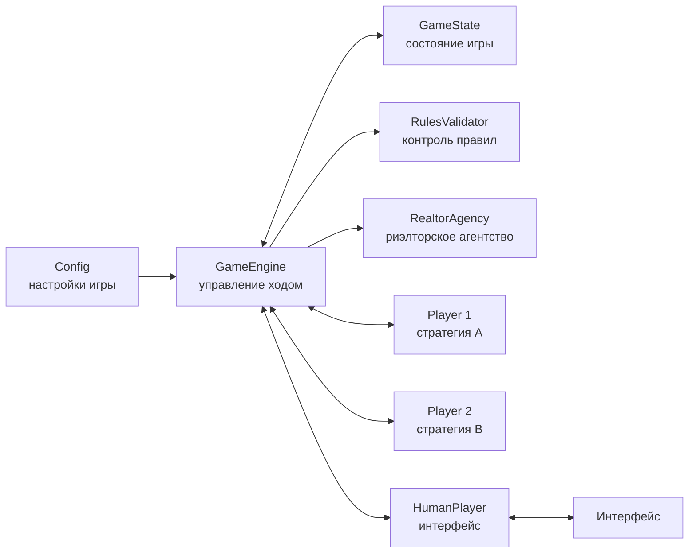
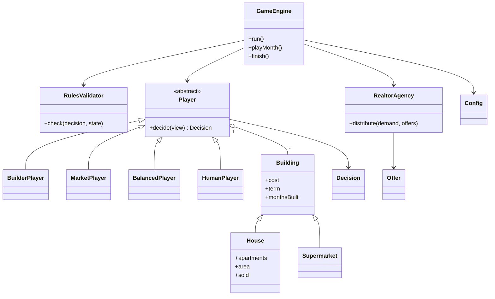
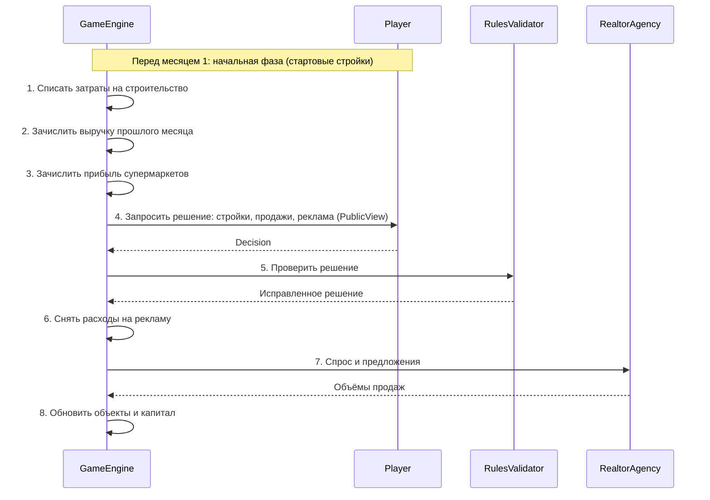
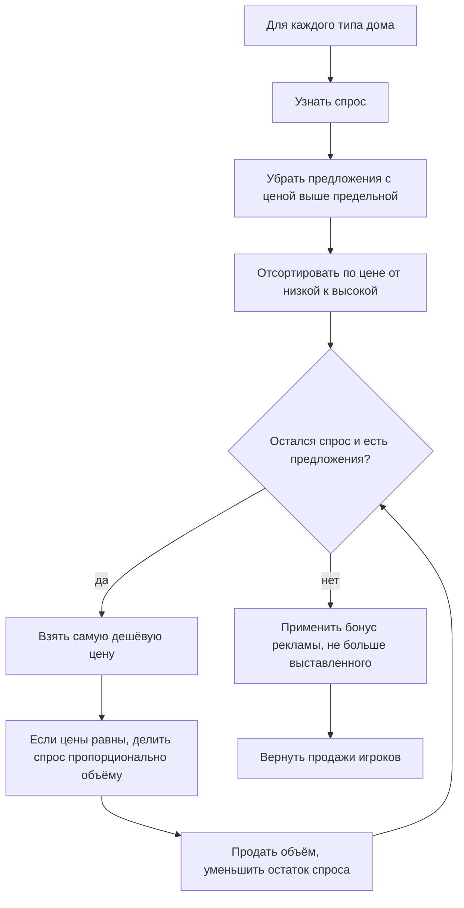

# Схемы и рисунки

## Рис. 1. Модули системы



## Рис. 2. Диаграмма классов



## Рис. 3. Один игровой месяц



## Рис. 4. Работа риэлторского агентства



## Рис. 5. Эскиз интерфейса игрока-человека

```text
+----------------------------------------------------------------+
| Месяц 5 из 12 (июль)                    Игрок: Хехе           |
+----------------------------------------------------------------+
| Мои деньги: 18,4 млн           Мой капитал: 41,2 млн           |
+----------------------------------------------------------------+
| Мои объекты                                                    |
|  Панельный дом #1   строится 4 из 7 мес.   продано: 0 квартир  |
|  Супермаркет #1     построен                                   |
+----------------------------------------------------------------+
| Другие игроки (открытая информация)                            |
|  Борис: 2 дома строится, 1 супермаркет построен                |
|  Борис продал в прошлом месяце: 24 квартиры по 3800 за кв. м   |
|  Вера: 3 дома строится                                         |
+----------------------------------------------------------------+
| Мои решения на этот месяц                                      |
|  Начать стройку:                [ нет v ]                      |
|  Выставить на продажу, квартир: [____]                         |
|  Цена за 1 кв. м:               [____]                         |
|  Реклама жилья, тыс.:           [____]                         |
|  Реклама супермаркетов, тыс.:   [____]                         |
|                                 [ Завершить ход ]              |
+----------------------------------------------------------------+
```

## Рис. 6. Сезонность

Коэффициент спроса на жильё (растёт с весны, максимум осенью):

```mermaid
xychart-beta
    title "Сезонный коэффициент спроса на жильё"
    x-axis [Янв, Фев, Мар, Апр, Май, Июн, Июл, Авг, Сен, Окт, Ноя, Дек]
    y-axis "коэффициент" 0 --> 2
    line [0.6, 0.6, 0.7, 0.8, 0.9, 1.0, 1.1, 1.2, 1.4, 1.5, 1.3, 0.8]
```

Коэффициент продаж в супермаркетах (растёт с осени, максимум зимой):

```mermaid
xychart-beta
    title "Сезонный коэффициент продаж в супермаркетах"
    x-axis [Янв, Фев, Мар, Апр, Май, Июн, Июл, Авг, Сен, Окт, Ноя, Дек]
    y-axis "коэффициент" 0 --> 2
    line [1.5, 1.3, 1.1, 0.9, 0.8, 0.8, 0.8, 0.9, 1.0, 1.1, 1.2, 1.4]
```
